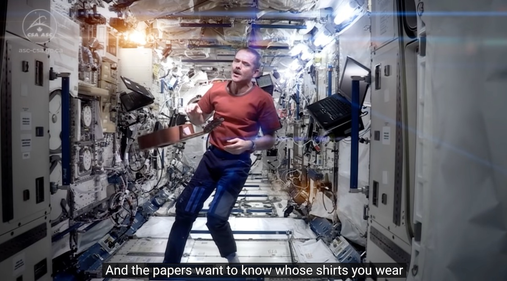

## Modern Introductory Physics &mdash; Daily Schedule Term 2

Course [home page](./)

See also: [Daily Schedule Term 3](./daily_schedule-term_3.html)

### Week 1 &mdash; Momentum and Momentum Conservation

* Preparation for Tuesday, Aug. 29 &mdash; Chapter 1 of *Matter &amp; Interactions* to p. 12 (approximately) &mdash; Front matter and Section C1 of *Six Ideas* to p. 10 (approximately) &mdash; Choose a problem to present from each text
* Preparation for Friday, Sept. 1 &mdash; [For Friday](./assignments/AssignmentFor2023-09-01.pdf) &mdash; Brian's Lightning [Calculus Refresher](./resources/CalculusRefresher.pdf)

### Week 2 &mdash; Coordinates and Reference Frames

* Preparation for Tuesday, Sept. 5 &mdash; [For Tuesday](./assignments/AssignmentFor2023-09-05.pdf)
* Tuesday, Sept. 5 &mdash; Physicists&rsquo; extension of PEMDAS &mdash; Description of the [Cavendish Experiment](./resources/CavendishExperiment.png) for measuring *G* &mdash; Relativistic momentum and the (1+&epsilon;)n approximation
* Preparation for Friday, Sept. 8 &mdash; [For Friday](./assignments/AssignmentFor2023-09-08.pdf)
* Friday, Sept. 8 &mdash; Proof that the CoM moves uniformly for an isolated system (Moore Section C4.3, p. 57-58) &mdash; What is the redefinition of velocity (not quite the way I would put it) that Moore referred to twice for relativistic momentum (but did not go into any detail)? &mdash; In the relativistic definition of momentum, you replace *&Delta;t* with *&Delta;&tau;* so *px=* lim*&Delta;*&tau;*&rarr;0* *m&Delta;x/&Delta;&tau;* and similarly for *py* and *pz* &mdash; *&Delta;&tau;* is the time elapsed according to the particle, not the observer, and it is smaller by the factor we called &gamma;, e.g., *&Delta;&tau;=&Delta;t/&gamma;*, and so the relativistic momentum is greater by a factor of &gamma; &mdash; It is the sum of the relativistic momenta that is conserved in an isolated system &mdash; The approximation *&theta;=*sin*&theta;=*tan*&theta;* is very useful &mdash; It is valid only when working in radians (convert to degrees later!), and it is only a good approximation for small *&theta;*

### Week 3 &mdash; Angular Momentum and Angular Momentum Conservation

* Preparation for Tuesday, Sept. 12 &mdash; [For Tuesday](./assignments/AssignmentFor2023-09-12.pdf)
* Preparation for Friday, Sept. 15 &mdash; [For Friday](./assignments/AssignmentFor2023-09-15.pdf)
* Friday, Sept. 15 &mdash; The reason for radians &mdash; The definition of angular velocity &mdash; The direction of the angular velocity vector &mdash; The angular momentum vector &mdash; The definition of torque &mdash; The units of torque

### Week 4 &mdash; Angular Momentum and Angular Momentum Conservation (Continued)

* Preparation for Tuesday, Sept. 19 &mdash; [For Tuesday](./assignments/AssignmentFor2023-09-19.pdf)
* Preparation for Friday, Sept. 22 &mdash; [For Friday](./assignments/AssignmentFor2023-09-22.pdf)

### Week 5  &mdash; Energy Conservation &mdash; Work

* Preparation for Tuesday, Sept. 26 &mdash; [For Tuesday](./assignments/AssignmentFor2023-09-26.pdf)
* Preparation for Friday, Sept. 29 &mdash; [For Friday](./assignments/AssignmentFor2023-09-29.pdf)
* Brian's Lightning [Trig Refresher](./resources/TrigRefresher.pdf) (should help with the cos&theta; that shows up in the work and dot product formulas)

### Week 6  &mdash; Rotational Energy

* Preparation for Tuesday, Oct. 3 &mdash; [For Tuesday](./assignments/AssignmentFor2023-10-03.pdf)
* Tuesday, Oct. 3 &mdash; The proof that the work your hand does on a spring when compressing it is *W=&half;ksx2*
* Preparation for Friday, Oct. 6 &mdash; [For Friday](./assignments/AssignmentFor2023-10-06.pdf)\
* Friday, Oct. 6 &mdash; We used some spare time to go back to the Work-Energy theorem (as it is often called, but Moore considers it to follow from mommentum conservation, which is indeed an ingredient of the derivation) &mdash; Moore used the derivation to define work &mdash; The definition makes it so that the work done on an object is its change in kinetic energy &mdash; Note that this definition of work has little to do with the human experience of work, but this is only because human muscles cannot maintain static force without expending chemical energy &mdash; In general, physicists are careful to define technical terms so that they refine but nonetheless agree with everyday experience &mdash; In this case, the technical term and the everyday experience diverge

### Week 7  &mdash; Midterm

* Saturday, Oct. 7 &mdash; Weekend Q&amp;A session at 1pm
* Tuesday, Oct. 10 &mdash; Midterm

Is Chris Hadfield's momentum changing? Is the momentum of his guitar &mdash; which is floating in front of him &mdash; changing? Is the momentum of the ISS changing?
